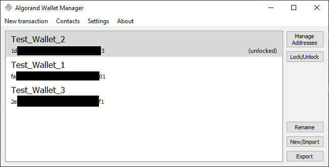

# Algorand Wallet Manager

### Description
This Python application is a graphic interface for the user who owns or have access to an Algorand
node and would like to issue operations through a GUI rather than CLI. (i.e.: manage wallets and addresses,
send transactions, save a contact list)

### File structure
main.py is the file that runs the application.  
ui_compile.py is the file that searches for any .ui file and then
compiles it into a python file that represents the interface.

### Requirements
* Python 3

Packages:
* PySide2
* algosdk
* jsonpickle

### Installation
on Ubuntu 18.04
- python3 -m pip install PySide2 py-algorand-sdk jsonpickle
